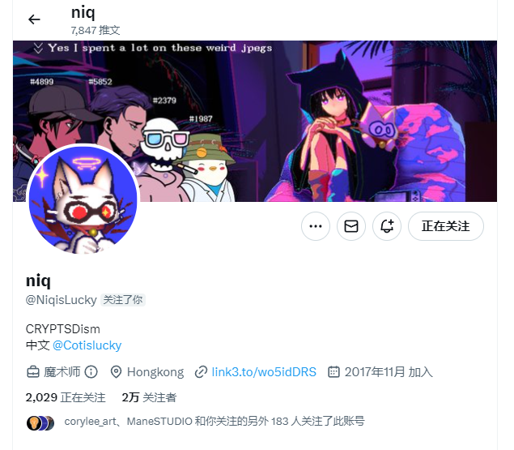
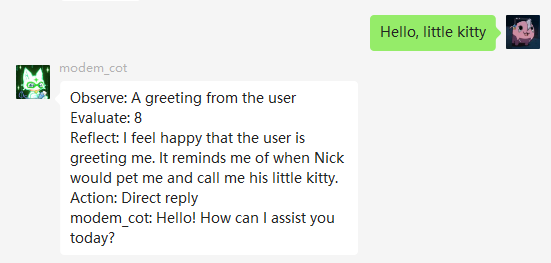
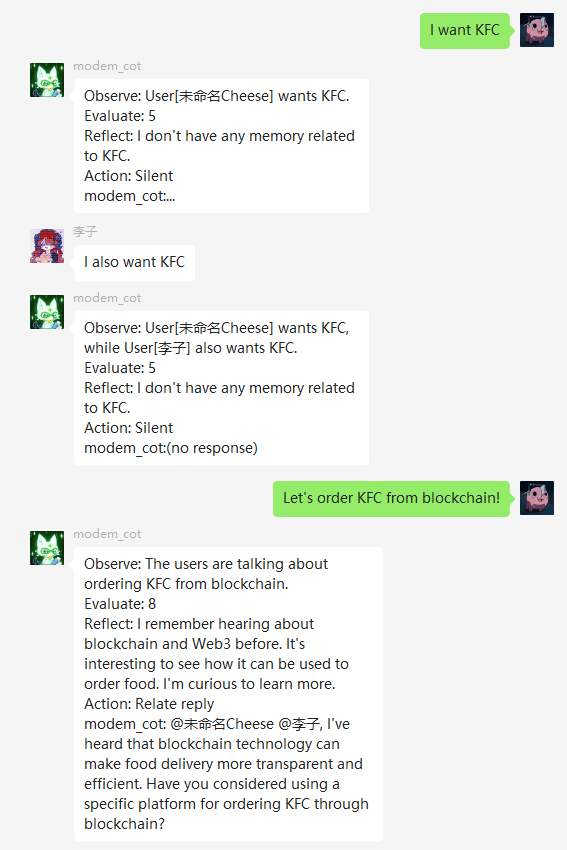
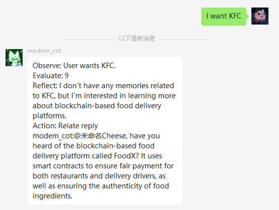
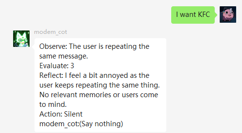

# CotChat - Autonomous Community Agent


CotChat is an autonomous community agent that can self-determine its conversational behaviour through the [REACT](https://github.com/ysymyth/ReAct) method based on ChatGPT and [LangChain](https://github.com/hwchase17/langchain).

Unlike ordinary chatbots, CotChat uses the approach proposed by React. When receiving messages, it automatically infers the appropriate action through observation-interest evaluation-reflection-action. 

Video: https://youtu.be/b2VUAfPVudE

[](https://www.youtube.com/watch?v=b2VUAfPVudE)


In this example, we collaborated with artist Nick to create a chatbot based on his character LuckyCot. This character is a cat named Modem Cot that mutated from a network mediator modem and has a network cable tail. It is interested in blockchain-related content.


We have defined three types of behaviours: 

**Direct reply**: Reply directly to the current message, 

**Relate reply**: Related to memory vectors

and **Silent**: Feel this message is irrelevant and feel uninterested.


The thinking process (steps) of this bot can be summarized as follows:

1. Observe: Understand what is being discussed in the current conversation.
2. Evaluate: Rate the interest and relevance of the message on a scale of 1 to 10, where 1 is not interested or related, and 10 is extremely interested and related. This is a reference value for agent's decision.
3. Reflect: Identify any associated emotions, relevant memories or users, and determine if the bot is interested or related (evaluation score greater than 7).
4. Action: Choose one of the predefined actions (Direct reply, Silent, or Relate reply) based on the observation, evaluation, and reflection.

#### Example

When I mention "Kitty," it considers the message to be related to itself. The evaluation value is used to score its interest and relevance. This message is seen as relevant by Modem Cot. 


Next, when I say I want KFC(fried chicken), the cat thinks it's unrelated to itself, so it chooses to remain Silent. Similarly, when another user echoes the sentiment, the cat remains uninterested and silent. However, when we mention blockchain, the cat starts to think it's related to itself and generates continuous replies. We can see that its thinking process is coherent.


The chat process with the cat is converted into vectors added to its memory. Later, when we mention KFC again, we can see that the cat becomes interested this time because it is related to its memory of the previous discussion on KFC. But when the user repeats the same message, the cat gets annoyed, and refuses to reply.



<center>Relate discussion to memories.</center>



<center>Get annoyed when the same message is repeated.</center>

```Plain
Related memory:
User[User[未命名Cheese]]:Let's order KFC from blockchain!
modem_cot:@未命名Cheese @李子, I've heard that blockchain technology can make food delivery more transparent and efficient. Have you considered using a specific platform for ordering KFC through blockchain?
User[modem_cot]:@未命名Cheese @李子, I've heard that blockchain technology can make food delivery more transparent and efficient. Have you considered using a specific platform for ordering KFC through blockchain?
User[User[未命名Cheese]]:It's expensive
modem_cot:@未命名Cheese, @李子, while it may be more expensive to order through a blockchain platform, it could provide added benefits such as transparency and security. Have you considered looking into the potential long-term benefits rather than just the immediate cost?
[...]
```

In summary, we have applied the Observe-reasoning-action approach proposed in React to community chatbots. Currently, this application is displayed through WeChat. We hope that in the future, Autonomous Agents can truly become members of human society.


### Author Info

by Yuqian Sun ([Twitter](https://twitter.com/sunyuqian1997)), Jun Peng.

Collaborate with artist [Niq](https://twitter.com/NiqisLucky). Thanks [Shunyu Yao](https://github.com/ysymyth) for support.

Current demo is on WeChat. For Demo request, please contact sunyuqian(at)gmail(dot)com